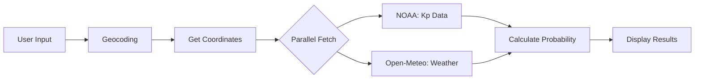

# 🌌 Aurora Forecast App

> Real-time aurora viewing predictions with intelligent weather integration

Aurora forecast app that combines **Kp-index data** from NOAA with **real-time cloud coverage** from Open-Meteo to show you your **actual chances** of seeing the Northern Lights.

## AI FIRST
Built with a prompt made to Claude, this app was first built as a school assignment where we where to build a simple MAUI applicationm and I wanted to try an AI first approach for the first time.

The result was okay for the backend but the fronend was honestly hideous so the xaml is built by me with the help of Gemini for guidance and troubleshooting.

I recently added the weather component to it and updated it to .NET10. The weather aspect was much needed since cloud coverage can completely distroy your chances to see the Aurora Borealis.

<table>
  <tr>
    <td></td>
    <td></td>
    <td></td>
  </tr>
</table>

## ✨ Features

- 🌍 **Search any city worldwide** - Get aurora predictions for your location
- 📊 **Current Kp-index** - Real-time geomagnetic activity from NOAA
- ☁️ **Weather integration** - Adjusts probability based on cloud coverage
- 📅 **3-day forecast** - Plan ahead with combined aurora + weather forecasts
- 🎯 **Smart probability calculation** - Accounts for latitude AND weather
- 🎨 **Beautiful UI** - Glassmorphism design with intuitive icons

## 🧮 How It Works

### The Magic Formula

```
Actual Viewing Probability = Base Aurora Probability - Cloud Penalty
```

**Base Aurora Probability** is calculated from:
- Current Kp-index (geomagnetic activity)
- Your latitude (further north = better chances)

**Cloud Penalty** is calculated from:
- Current cloud coverage percentage
- Clear skies (< 5% clouds) = No penalty ⭐
- Partly cloudy (< 20%) = Small penalty 🌟
- Mostly cloudy (< 50%) = Medium penalty ☁️
- Overcast (≥ 50%) = Large penalty ☁️☁️

### Example Scenarios

#### ✅ Perfect Conditions
```
Location: Kiruna, Sweden (67.86°N)
Kp-index: 3.0
Cloud coverage: 5%

→ Base probability: 70%
→ Cloud penalty: 0%
→ Actual: 70% ⭐
```

#### ⚠️ High Aurora, Bad Weather
```
Location: Kiruna, Sweden (67.86°N)
Kp-index: 5.0 (Storm!)
Cloud coverage: 80%

→ Base probability: 90%
→ Cloud penalty: -80%
→ Actual: 10% ☁️☁️
```
*Aurora is likely happening, but you won't see it through the clouds!*

## 🏗️ Architecture

### Clean Separation of Concerns

```
┌──────────────────────────────────────┐
│  VIEW (XAML + ViewModel)             │
│  - Displays data to user             │
│  - Handles user interactions         │
└──────────────┬───────────────────────┘
               │
┌──────────────▼───────────────────────┐
│  SERVICES                            │
│  - AuroraService (NOAA API)          │
│  - WeatherService (Open-Meteo API)   │
│  - GeocodingService (OSM)            │
└──────────────┬───────────────────────┘
               │
┌──────────────▼───────────────────────┐
│  HELPERS                             │
│  - ProbabilityDisplayHelper          │
│    • Calculates aurora probability   │
│    • Adjusts for cloud coverage      │
└──────────────┬───────────────────────┘
               │
┌──────────────▼───────────────────────┐
│  MODELS (Pure Data)                  │
│  - AuroraForecast                    │
│  - Weather                           │
│  - ForecastDay                       │
└──────────────────────────────────────┘
```

## 🔄 Data Flow



**Detailed Flow:**
1. User searches for a city (e.g., "Tromsø")
2. Geocoding service converts city → coordinates
3. **Parallel API calls:**
   - Fetch Kp-index from NOAA Space Weather API
   - Fetch cloud coverage from Open-Meteo API
4. Calculate actual viewing probability (Kp + latitude - clouds)
5. Display results with weather context
6. Fetch 3-day forecasts (aurora + weather combined)

## 🌐 APIs Used

| Service | API | Purpose | Cost |
|---------|-----|---------|------|
| Aurora Data | [NOAA Space Weather](https://www.swpc.noaa.gov/) | Real-time Kp-index & forecasts | Free ✅ |
| Weather Data | [Open-Meteo](https://open-meteo.com/) | Cloud coverage & forecasts | Free ✅ |
| Geocoding | [OpenStreetMap Nominatim](https://nominatim.org/) | City name → coordinates | Free ✅ |

*All APIs are free and require no API keys!*

## 📊 Probability Calculation Details

### Cloud Coverage Impact

Cloud coverage directly reduces your viewing probability:

| Cloud Coverage | Penalty | Viewing Condition |
|----------------|---------|-------------------|
| 0-5% | 0% | ⭐ Perfect - Clear skies |
| 5-20% | -2 to -5% | 🌟 Good - Partly cloudy |
| 20-50% | -10 to -35% | ☁️ Difficult - Mostly cloudy |
| 50-70% | -50 to -65% | ☁️ Very difficult |
| 70-100% | -65 to -80% | ☁️☁️ Nearly impossible |

### Latitude Adjustment

Your latitude affects base probability:

| Latitude | Adjustment |
|----------|------------|
| Above 65°N | +20% bonus (Arctic) |
| 55-65°N | +10% bonus (Northern Europe) |
| 45-55°N | No adjustment |
| Below 45°N | -20% penalty (Rare sightings) |

## 🛠️ Tech Stack

- **.NET MAUI** - Cross-platform app framework
- **MVVM Pattern** - Clean architecture with CommunityToolkit.Mvvm
- **HttpClient** - RESTful API calls
- **ObservableCollections** - Reactive UI updates
- **Singleton Pattern** - Efficient service management

## 📱 Platforms

- ✅ Windows
- ✅ Android
- ✅ iOS (untested)
- ✅ macOS (untested)

## 🚀 Getting Started

```bash
# Clone the repository
git clone https://github.com/yourusername/aurora-forecast.git

# Open in Visual Studio 2022 or 2026
# Select target platform (Windows/Android)
# Build and run!
```

**Requirements:**
- .NET 10 SDK
- Visual Studio 2022 or 2026 with MAUI workload

## 🤝 Contributing

Contributions welcome! Please feel free to submit a Pull Request.

## 🙏 Acknowledgments

- **NOAA Space Weather Prediction Center** - Aurora data
- **Open-Meteo** - Weather data
- **OpenStreetMap** - Geocoding services

---

**Made with ❤️ for aurora chasers worldwide** 🌌⭐

*Never miss the Northern Lights again!*
