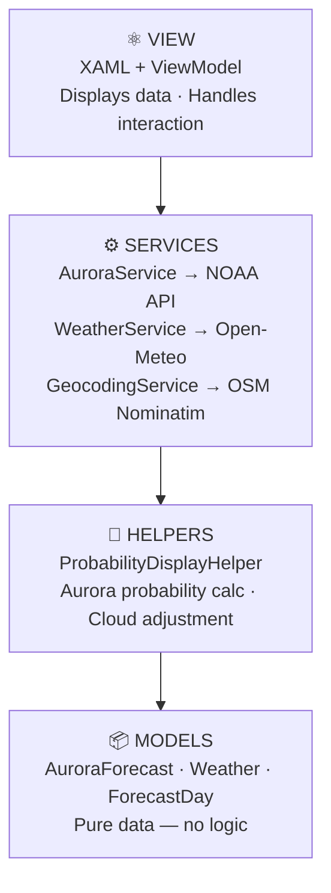
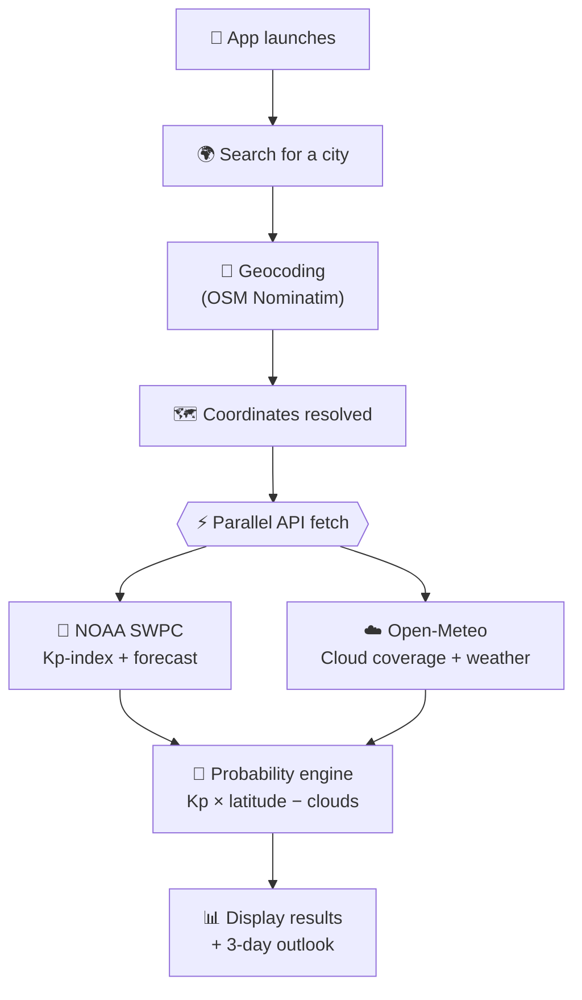

# 🌌 Aurora Forecast

*Chase the Northern Lights with real-time aurora forecasts powered by live space weather data*

<p align="left">
  
  
  
  
</p>

<table>
  <tr>
    <td align="center">
      <br/>
      <sub><b>🤖 AI-generated UI — Claude's first draft</b></sub>
    </td>
    <td align="center">
      <br/>
      <sub><b>✨ My redesign — polished by hand</b></sub>
    </td>
    <td align="center">
      <br/>
      <sub><b>✨ My redesign — forecast view</b></sub>
    </td>
  </tr>
</table>

---

## 🤖 Born from an Experiment

Aurora Forecast started as an experiment: *what happens when you let an AI build an entire MAUI app from scratch?*

The app was built by Claude, the result was surprisingly solid, but the UI? That needed a human touch.

The entire frontend was then torn down and rebuilt by me — every animation and every detail made to feel as magical as the aurora itself. What started as an AI experiment became a proper app, and it's still growing.

The best of both worlds: machine precision meets human design. 

---

## ✨ Features

- 🌍 Search any city worldwide for real-time aurora forecasts
- 📊 Live Kp-index data straight from NOAA's Space Weather Prediction Center
- ☁️ Cloud coverage integration via Open-Meteo
- 📅 3-day combined aurora + weather outlook
- 🎯 Smart probability engine (latitude × Kp × weather)
- 🧮 Animated probability display
- ⚡ Parallel API pipeline — all data fetched simultaneously for fast results
- 🛡️ Graceful error handling — clear overlay on failure, one tap to retry
- 🖥️ Cross-platform possibilities: Windows, Android, iOS, macOS

---

## 📡 Powered by NOAA

The aurora data in AuroraFix comes directly from **NOAA** — the National Oceanic and Atmospheric Administration, a U.S. federal science agency. Their **Space Weather Prediction Center (SWPC)** in Boulder, Colorado operates 24/7, monitoring the Sun and Earth's magnetic environment in real time.

The key metric AuroraFix uses is the **Kp-index** — the *planetary geomagnetic disturbance index* — a 0–9 scale measuring how disturbed Earth's magnetic field is. A high Kp means solar wind is actively interacting with the magnetosphere. A Kp of 5 or above typically signals aurora visible at mid-latitudes. At 8–9, the lights can reach southern Europe and even parts of the US.

Every forecast in AuroraFix is built on this live NOAA stream. No guessing. No delays. Just space weather, straight from the source.

> **Reliability note:** NOAA's 1-minute Kp stream resets to near-zero at each 3-hour UTC boundary (00:00, 03:00, 06:00…). To avoid falsely low readings right after a boundary, AuroraFix always reports the **peak Kp over the last 30 minutes** — so a boundary reset never tanks your forecast.

---
## 🏗️ Architecture

Aurora Forecast is built with a clean MVVM separation of concerns. Each layer does exactly one thing.



---

## 🔄 Data Flow



**Step by step:**
1. Search for any city by name
2. City name is resolved to coordinates via Geocoding (OSM Nominatim)
3. Four API calls fire in parallel (`Task.WhenAll`):
   - NOAA SWPC → current Kp-index (peak over last 30 min)
   - NOAA SWPC → 3-day geomagnetic forecast
   - Open-Meteo → current cloud coverage + weather
   - Open-Meteo → 3-day hourly forecast
4. Probability engine combines Kp, latitude, and cloud penalty
5. Results are displayed with animated probability and forecast cards

---

## 🌐 APIs

All APIs are completely free, open, and require no API keys.

| Service | Provider | Purpose |
|---------|----------|---------|
| ☀️ Aurora & Kp data | [NOAA SWPC](https://www.swpc.noaa.gov/) | Real-time space weather, Kp-index, 3-day forecasts |
| ☁️ Weather & clouds | [Open-Meteo](https://open-meteo.com/) | Cloud coverage, hourly + daily weather |
| 📍 Geocoding | [OpenStreetMap Nominatim](https://nominatim.org/) | City name → GPS coordinates |

---

## 📐 Probability Details

### How the Base Probability Is Calculated

AuroraFix uses your latitude to determine the minimum Kp needed to see aurora overhead:

```
requiredKp = (67.0 − latitude) / 1.5
```

The further north you are, the lower the bar. Then the actual base probability scales with how much the live Kp *exceeds* that threshold:

| Kp vs threshold | Base probability |
|-----------------|-----------------|
| Below threshold | 0–5% |
| At threshold | ~10% |
| +1 above | ~35% |
| +2 above | ~60% |
| +3 above | ~90% |

**Example — Östersund, Sweden (63.2°N):**  
`requiredKp = (67.0 − 63.2) / 1.5 ≈ 2.5`  
At Kp 3.5 (diff +1), base probability ≈ 35%. At Kp 5 (diff +2.5), base ≈ 75%+.


## 🧮 The Magic Formula

```
Actual Viewing Probability = Base Aurora Probability − Cloud Penalty
```

**Base Aurora Probability** is calculated from:
- Current Kp-index (geomagnetic activity level, 0–9)
- Your latitude (further north = better chances)

**Cloud Penalty** reduces your probability based on real-time sky conditions:

| Cloud Coverage | Penalty | Viewing Condition |
|----------------|---------|-------------------|
| 0–5% | 0% | ⭐ Perfect — clear skies |
| 5–20% | −2 to −5% | 🌟 Good — partly cloudy |
| 20–50% | −10 to −35% | ☁️ Difficult — mostly cloudy |
| 50–70% | −50 to −65% | ☁️ Very difficult |
| 70–100% | −65 to −80% | ☁️☁️ Nearly impossible |

### Example Scenarios

#### ✅ Perfect Night
```
Location: Kiruna, Sweden (67.86°N)
Kp-index: 3.0 | Cloud coverage: 5%
→ Base: 70%  → Penalty: 0%  → Actual: 70% ⭐
```

#### ⚠️ Aurora Active, Sky Closed
```
Location: Kiruna, Sweden (67.86°N)
Kp-index: 5.0 (Storm!) | Cloud coverage: 80%
→ Base: 90%  → Penalty: −80%  → Actual: 10% ☁️☁️
```
*The lights are dancing — you just can't see them through the clouds.*

---

---

## 🛠️ Tech Stack

- **.NET MAUI** — Cross-platform framework (Windows, Android, iOS, macOS)
- **MVVM + CommunityToolkit.Mvvm** — Clean, reactive architecture
- **HttpClient** — Lightweight RESTful API communication
- **ObservableCollections** — Live UI updates without boilerplate
- **Singleton services** — Efficient, shared API clients

---

## 📱 Platform Support

| Platform | Status |
|----------|--------|
| Windows | ✅ Fully supported |
| Android | ✅ Fully supported |
| iOS | ✅ Builds (untested on device) |
| macOS | ✅ Builds (untested on device) |

---

## 🙏 Acknowledgments

- **[NOAA Space Weather Prediction Center](https://www.swpc.noaa.gov/)** — The backbone of every forecast
- **[Open-Meteo](https://open-meteo.com/)** — Beautiful open weather API
- **[OpenStreetMap / Nominatim](https://nominatim.org/)** — Open geocoding for the world

---

<p align="center">
  <b>© 2026 Sigge1511</b> — please don't steal my aurora 🌌
</p>

<p align="center">
  Made with ❤️ for aurora chasers everywhere 🌌⭐<br/>
  <i>Never miss the Northern Lights again.</i>
</p>
